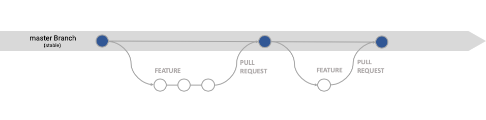

| [Home](README.md) ▸ **Continuous Deployment** |
|-----|

# Continuous Deployment

Deployment method where features get released as soon as they are ready.

I am following the [**GitHub flow**](https://guides.github.com/introduction/flow/) workflow as closely as possible. 

This page showcases common development scenarios and how to deal with them from a branching point of view.

- [Branches Overview](#branches-overview)
- [Use Cases](#use-cases)
  - [Develop a new feature](#develop-a-new-feature)
  - [Develop multiple features in parallel](#develop-multiple-features-in-parallel)
  - [Create and deploy a release](#create-and-deploy-a-release)
  - [Change in plan, pull a feature from a release](#change-in-plan-pull-a-feature-from-a-release)
  - [Change request](#change-request)
  - [Production hot fix](#production-hot-fix)

## Branches Overview

| Branch  | Protected?  | Base Branch      | Description    |
| :-------|:------------|:-----------------|:---------------|
| `master`| YES         | N/A              | What is live in production (**stable**). A pull request is required to merge code into `master`. |
| `feature/GH-*` | NO          | `master`         | Cutting-edge features (**unstable**). These branches are used for any maintenance features / active development. |
| `hotfix/GH-` | NO       | `master`         | These are bug fixes against production.  |

## Use Cases
