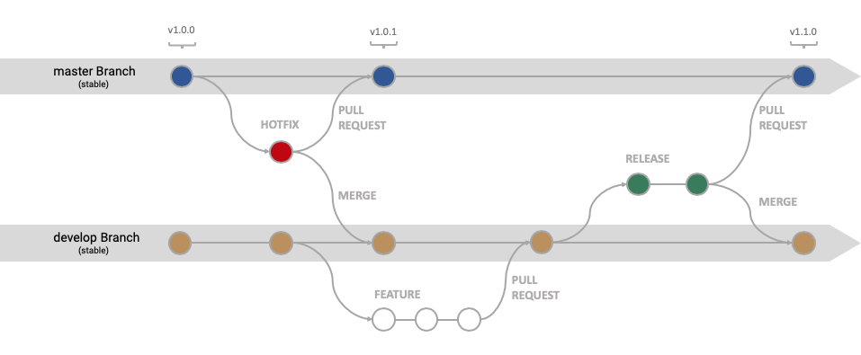

| [Home](README.md) ▸ **Release Deployment** |
|-----|

# Release Deployment

Deployment method where features get bundled in a release and then deployed together.

I am following the [**Gitflow**](https://www.atlassian.com/git/tutorials/comparing-workflows/gitflow-workflow) workflow as closely as possible.

This page showcases common development scenarios and how to deal with them from a branching point of view.

- [Branches Overview](#branches-overview)
- [Use Cases](#use-cases)
  - [Develop a new feature](#develop-a-new-feature)
  - [Develop multiple features in parallel](#develop-multiple-features-in-parallel)
  - [Create and deploy a release](#create-and-deploy-a-release)
  - [Change in plan, pull a feature from a release](#change-in-plan-pull-a-feature-from-a-release)
  - [Change request](#change-request)
  - [Production hot fix](#production-hot-fix)

## Branches Overview

| Branch        | Protected? | Base Branch | Description    |
| :-------------|:-----------|:------------|:---------------|
| `master`      | YES        | N/A         | What is live in production (**stable**). A pull request is required to merge code into `master`. |
| `develop`     | YES        | `master`    | The latest state of development (**stable**). |
| `feature/GH-*`| NO         | `develop`   | Cutting-edge features (**unstable**). These branches are used for any maintenance features / active development. |
| `release/v-X-Y-Z`| NO         | `develop`    | A temporary release branch that follows the [semver](http://semver.org/) versioning. This is what is sent to UAT. A pull request is required to merge code into any `release/v-X-Y-Z` branch. |
| `bugix/GH-*`  | NO         | `release/v-X-Y-Z` | Any fixes against a release branch should be made in a bug-fix branch. The bug-fix branch should be merged into the release branch and also into develop. This is one area where we’re deviating from GitFlow. |
| `hotfix/GH-*`    | NO         | `master`    | These are bug fixes against production. This is used because develop might have moved on from the last published state. Remember to merge this back into develop and any release branches. |

## Use Cases
